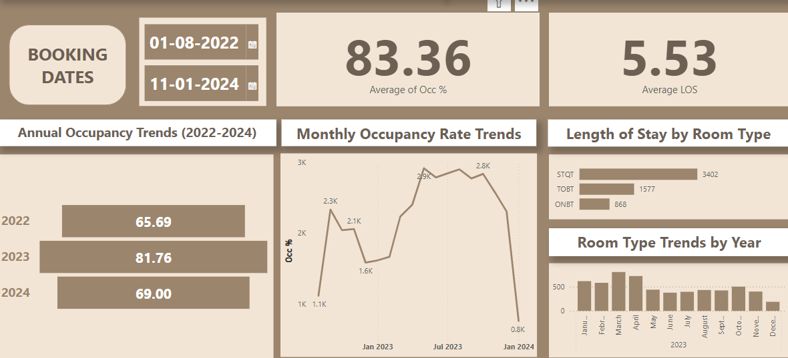
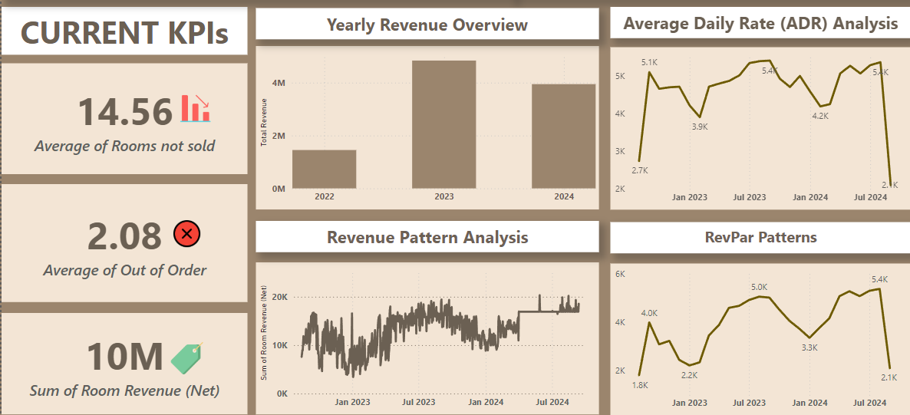
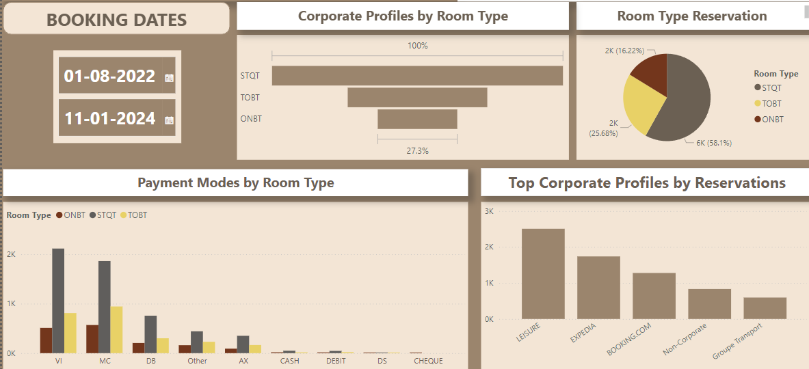

# Hotel Revenue & Occupancy Dashboard Project

## Overview
This project focuses on analyzing historical sales and reservation data to optimize hotel revenue, forecast occupancy trends, and provide actionable insights through interactive dashboards. By leveraging **Python** for data processing and modeling, and **Power BI** for visualization, the project delivers a comprehensive solution tailored to the hospitality industry.

---

## Key Features

### 📊 Revenue Optimization
- Analyzed **21+ months** of historical sales and reservation data.
- Forecasted occupancy trends and optimized room pricing metrics like **ADR** (Average Daily Rate) and **RevPAR** (Revenue Per Available Room).
- Identified booking patterns to enhance revenue strategies.

### 💡 Customer Segmentation
- Distinguished between **corporate** and **leisure** customer segments.
- Developed targeted strategies for personalized marketing and pricing optimization.

### 📈 Predictive Insights
- Leveraged advanced forecasting models such as **ARIMA** and **CNN** to predict future revenue and occupancy trends with an error rate of just **5%**.
- Enabled smarter operational planning based on data-driven predictions.

### 🚀 Dashboard Development
- Designed interactive **Power BI dashboards** that visualize key KPIs like ADR, RevPAR, occupancy rates, and customer segmentation.
- Dashboards provide actionable insights for:
  - Pricing optimization.
  - Marketing strategy.
  - Staffing and operational efficiency.

---

## Tech Stack
- **Python**: For ETL (Extract, Transform, Load) processes and predictive modeling.
- **Power BI**: For building interactive dashboards and visualizations.

## Screenshots

### Current KPIs Dashboard

### Revenue Trends Dashboard

### Customer Segmentation Dashboard

